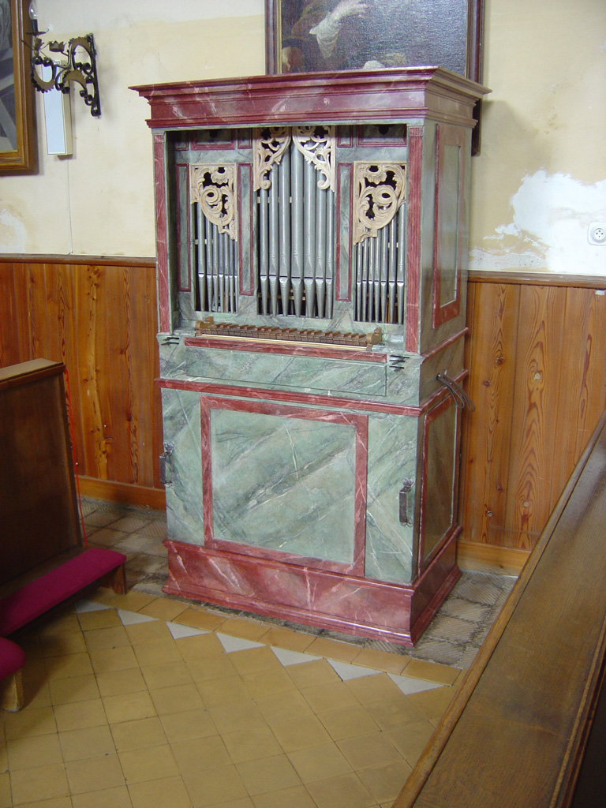
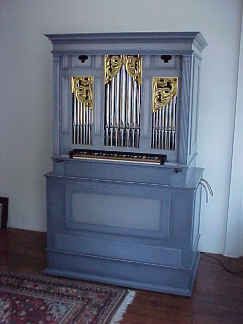
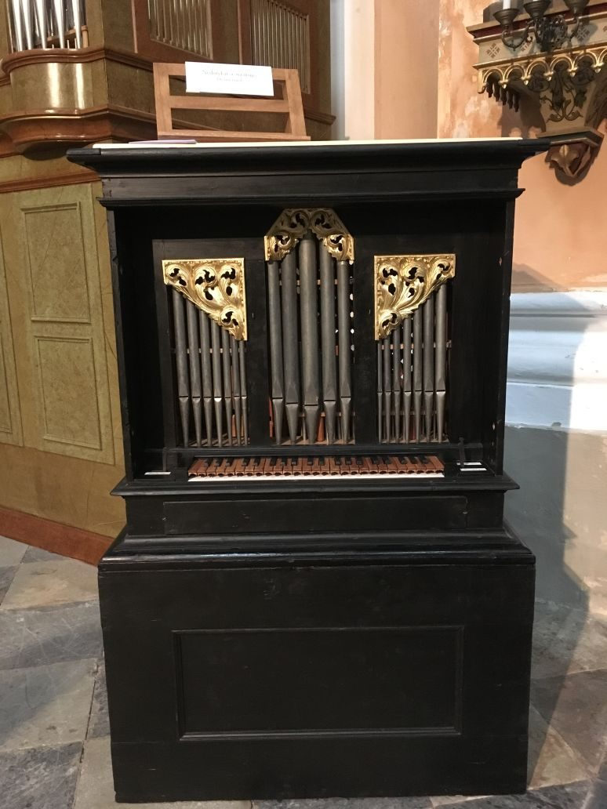

# Vicar' organ

This is class of Portative pipe organ in the smallest version with manual only. Usually it is a movable organ, more detailed specifications are on the wiki page [Positive organ](https://en.wikipedia.org/wiki/Positive_organ) or static [Portative organ](https://en.wikipedia.org/wiki/Portative_organ).

A basic type of organ for those who only have one midi keyboard controller. But even in the 18th century there were musical instruments for poorer parishes.

I was inspired by the following pipe organs.

## organ1

Maker: unknown master 1700-1730

Manual in range C–c´´´,

Meatone tempering, a = 415 Hz

1. Copula 8´
1. Copula 4´
1. Principal 2´
1. Quinta 1½´
1. Octava 1´

{width=33%}

This organ positive was built by an unknown master around the beginning of the 18th century, probably in Bohemia. In the course of the 19th century, modifications were apparently made, or the positive was newly completed from the non-functional parts of an older instrument. This cannot be ascertained and even during the restoration it was not possible to answer these questions.

In 1981, the positive was stripped of probably non-original polychromy (perhaps from the intervention in the 19th century), reassembled, put into operation and equipped with an engine by the organist František Krutský (Igra organ team), because the then owner received it as a gift from the parish priest in Svárov near Unhoště unplayable state in crates. The parish priest got it from somewhere in South Bohemia. Today he is no longer alive, so it will not be possible to find out from where.

In 2000 it was bought by Pavel Černý and in 2003 he took it to the Netherlands, where under the guidance of the organist Hans van Rossum, he carefully restored it and prepared it for the final polychromy, which was done by the academic painter Peter Stirber. Aleš Repka from the Kánský–Brachtl organ workshop, Dalibor Michek and Petr Dlabal participated in the restoration of the cabinet and wooden pipes. Taken from http://www.varhany.slansko.cz/2012/varhany/varhanni-pozitiv-a-kopie.html

Concert played on this pipe organ are on https://www.youtube.com/watch?v=nbIyvL59y8o

<figure class="video_container">
  <iframe width="560" height="315" src="https://www.youtube.com/embed/nbIyvL59y8o" title="YouTube video player" frameborder="0" allow="accelerometer; autoplay; clipboard-write; encrypted-media; gyroscope; picture-in-picture; web-share" allowfullscreen></iframe>
</figure>

Source:

[1] http://www.varhany.slansko.cz/2012/varhany/varhanni-pozitiv-a-kopie.html

## organ2
Maker: Hans Van Rossum, 2003

Manual in range C–d´´´
Vallotti tempering, a = 415-440 Hz	

1. Copula 8´
1. Flute 4´
1. Principal 2´
1. Quinta 1½´
1. Octava 1´

{width=33%}

Source:

[1] http://www.varhany.slansko.cz/2012/varhany/varhanni-pozitiv-a-kopie.html

[2] https://rossumorgelbouw.nl/projects/berlijn-nieuwbouw-2003/

## organ3

Maker: Tauchmann, cca 1700

Restaured by Žloutek and son, 2017 [6]

owner: Vrchlabí city

Manual range tempering is not mentioned

1. Flute 8´
1. Flute 4´
1. Principal 2´

{width=33%}

An exceptional musical instrument, made around the year 1700 by the famous organ workshop of the Tauchmann family in Vrchlabi, sounds again in the place where it came from, i.e. in the St. Augustine Church in Vrchlabi city.

It is exceptional in that ninety percent of it was preserved in its original state, with only minor modifications that occurred over the course of individual centuries,

Specialists in the restoration of historic instruments Žloutek aand son from Zásada undertook the half-yearly repairs. The organ was preserved, but unusable. The manual treading of the bellows had to be modified, the air box dismantled, the whistles refilled, irradiated against worms, and the carvings gilded.

The unique organ rose from the ashes also thanks to the support of the Hradec Králové region and the city of Vrchlabí, the costs were close to 190 thousand crowns.

Source:

[3] https://hradec.rozhlas.cz/adventni-hudebni-pozdrav-cast-vanocni-pastorely-v-podani-snad-nejvzacnejsich-8371787

[4] https://krkonossky.denik.cz/zpravy_region/ve-vrchlabi-oprasili-tri-sta-let-stare-varhany-z-tamni-dilny-20170816.html

[5] https://hradec.rozhlas.cz/nejstarsi-varhany-v-krkonosich-najdete-ve-vrchlabi-jejich-historie-a-osud-vydaly-6117533

[6] http://www.stavbavarhan.cz/

# Definition files

In table are mentioned all stops stored in Vicar's directory in ae0 definition files. Files copula_8.ae0, copula_4.ae0, principal_2.ae0, quinte_113.ae0, octave_1.ae0 were created from sonically related file. Next step was editing all files in Aeolus, editor of stops are open after CTRL+clic on name of stop.
The all tree organs have the same stop "Principal 2'", becous the definition file principal_2.ae0 are common they will sound approximately the same. Approximately because they will be affected by pitch and type of tuning (eleven different temperaments).

| stops / tunning| organ1 | organ2 | organ3 |
| :---           | :---:  | :---:  | :---:  |
| copula_8.ae0   |  yes   |  yes   |        |
| copula_4.ae0   |  yes   |        |        |
| flute8.ae0     |        |        |  yes   |
| flute4.ae0     |        |  yes   |  yes   |
| principal_2.ae0|  yes   |  yes   |  yes   |
| quinte_113.ae0 |  yes   |  yes   |        |
| octave_1.ae0   |  yes   |  yes   |        |
| a              |  415   |  440   |  435   |
| temperaments   | Meantone |   Vallotti |  Pythagorean  |

Directory /waves must be writable.

The resulting sound of the pipe organs will certainly not match the originals, this description tried to describe a possible approach to the creation of virtual instruments.

